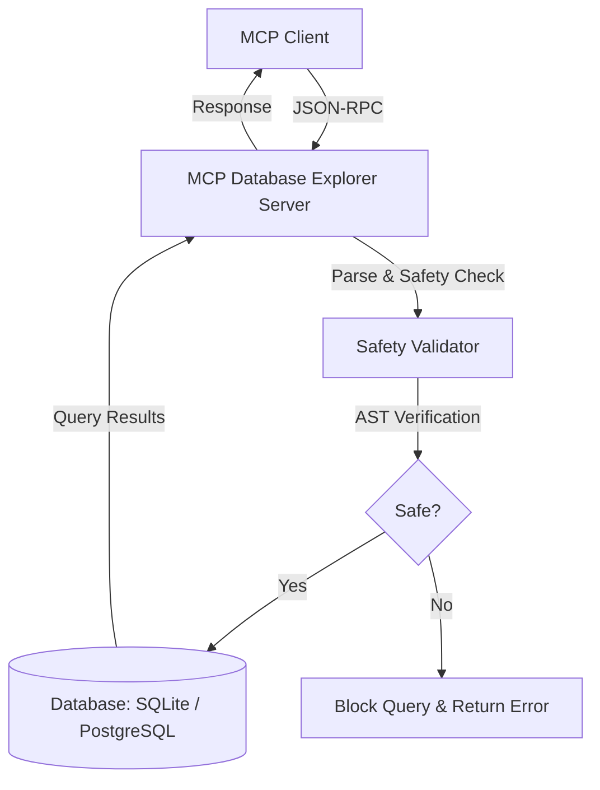

# Model Context Protocol Database Explorer

[](https://github.com/arman1o1/mcp-db-explorer/actions/workflows/ci.yml)

A Model Context Protocol (MCP) server that exposes tools for exploring and querying SQLite and PostgreSQL databases. It allows Large Language Models (LLMs) to inspect table structures, perform statistical profiling, generate entity-relationship diagrams, and execute queries safely.

## Overview

The Database Explorer MCP Server provides a bridge between LLMs and SQL databases. It features read-only constraints by default, AST-based query safety verification, automatic schema visualization, and execution plan inspection tools.

## Architecture

The diagram below outlines the flow of a client request to the database via the MCP server:



## Project Structure

```text
mcp-db-explorer/
├── .github/
│   └── workflows/
│       └── ci.yml             # GitHub Actions CI workflow
├── mcp_db_explorer/
│   ├── __init__.py
│   ├── database.py            # Database connection and querying logic
│   ├── prompts.py             # Prompt templates (e.g. NL-to-SQL)
│   ├── safety.py              # AST-based SQL safety validation
│   └── server.py              # MCP Server definition and CLI entrypoint
├── tests/
│   ├── test_database.py       # Tests for database connections and queries
│   ├── test_safety.py         # Tests for AST query validation
│   └── test_server.py         # Tests for MCP server tool schemas
├── pyproject.toml             # Project dependency configuration
└── README.md                  # Project documentation
```

## Setup and Installation

### Prerequisites

Ensure you have Python 3.10 or later installed on your system.

### 1. Clone the Repository

```bash
git clone https://github.com/arman1o1/mcp-db-explorer
cd mcp-db-explorer
```

### 2. Setup and Install Dependencies

#### Option A: Using uv (Recommended)

This project is configured with `uv`. To install dependencies and set up the virtual environment, run:

```bash
uv sync
```

#### Option B: Using pip and venv

You can set up a virtual environment and install dependencies manually:

```bash
python -m venv .venv
source .venv/bin/activate  # On Windows: .venv\Scripts\activate
pip install -e .
```

## Running the Application

### Running with uv

To run the MCP server, use the `uv run` command:

```bash
uv run mcp-db-explorer --db-type sqlite --connection-string my_database.db
```

### Configuration Options

The server accepts several options via command-line arguments or environment variables:

| Argument | Environment Variable | Description |
|---|---|---|
| `--db-type` | `DB_TYPE` or `MCP_DB_TYPE` | Default database engine type (`sqlite`, `postgres`, `postgresql`) |
| `--connection-string` | `DATABASE_URL` or `MCP_DB_CONNECTION_STRING` | Database connection string (path for SQLite, URI for PostgreSQL) |
| `--allow-writes` | `ALLOW_WRITES` | Enable write operations (DML/DDL queries). Disabled by default. |
| `--allowed-dir` | `ALLOWED_DATABASE_DIR` | Restricts SQLite database paths to be inside this directory. |

## Client Integration

To use this server with an MCP client (such as Claude Desktop), add the server configuration to your client configuration file.

### Claude Desktop Configuration

Open your `claude_desktop_config.json`:
- **Windows**: `%APPDATA%\Claude\claude_desktop_config.json`
- **macOS**: `~/Library/Application Support/Claude/claude_desktop_config.json`

Add the following configuration (use absolute paths):

```json
{
  "mcpServers": {
    "mcp-db-explorer": {
      "command": "uv",
      "args": [
        "--directory",
        "C:\\absolute\\path\\to\\mcp-db-explorer",
        "run",
        "mcp-db-explorer",
        "--db-type",
        "sqlite",
        "--connection-string",
        "C:\\absolute\\path\\to\\my_database.db"
      ]
    }
  }
}
```

Replace the paths with the correct ones for your local setup.

## Testing

To run the test suite, run:

```bash
uv run pytest
```

## License

This project is licensed under the MIT License - see the [LICENSE](LICENSE) file for details.
